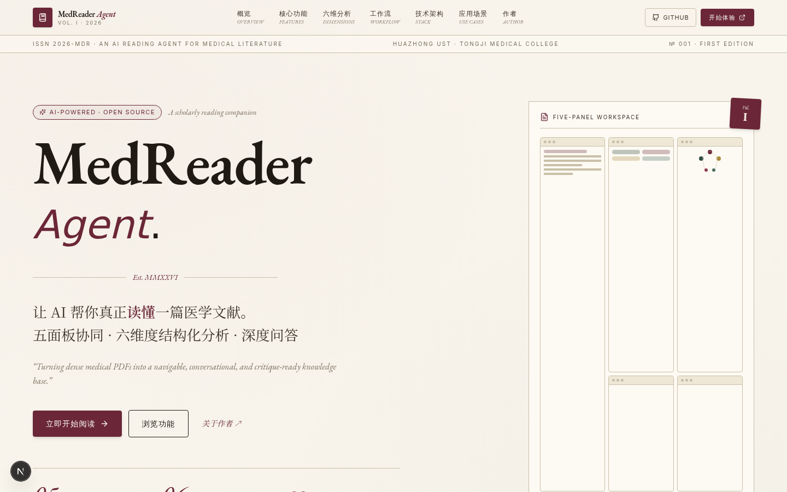
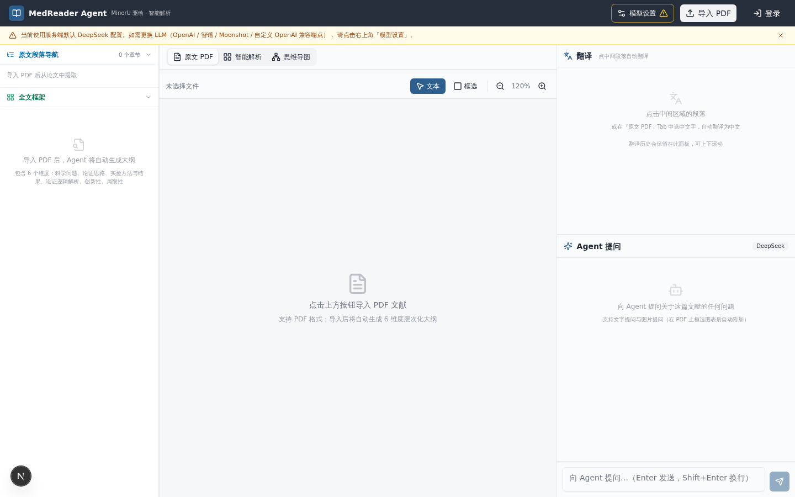
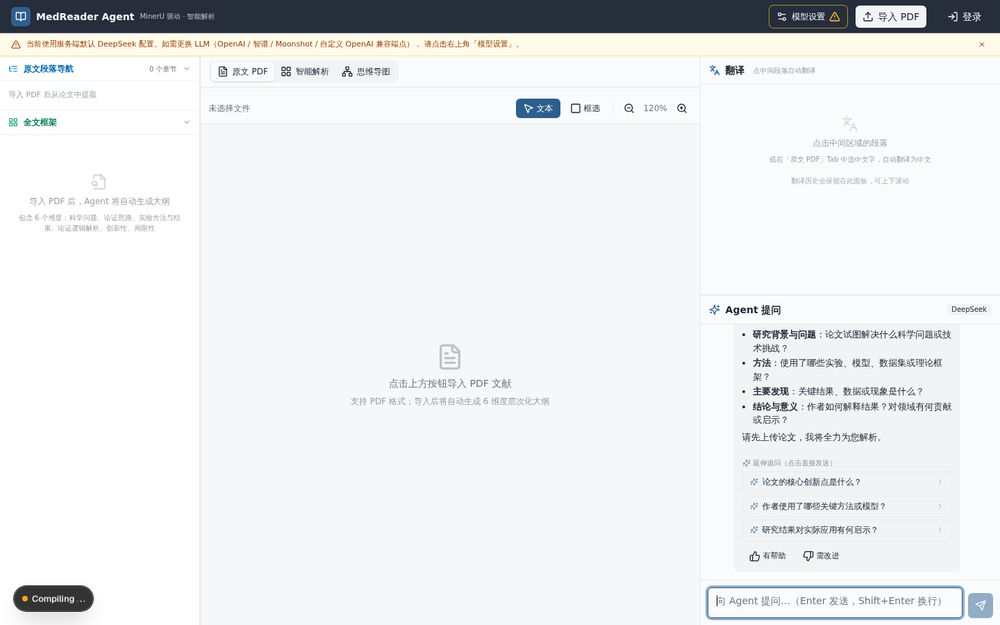

<div align="center">

# MedReader Agent

**让 AI 帮你真正读懂一篇医学文献。**

面向医学研究者的 AI 文献阅读 Agent — 五面板协同工作区 + 六维度论文分析 + DeepSeek 大模型问答

[](https://nextjs.org/)
[](https://www.typescriptlang.org/)
[](https://tailwindcss.com/)
[](https://www.prisma.io/)
[](LICENSE)

[功能演示](#-核心功能) · [快速开始](#-快速开始) · [在线预览](#-在线预览) · [部署指南](#-部署) · [项目白皮书](./download/MedReader-Agent-项目白皮书.pdf)

</div>

---



<div align="center"><em>学术期刊风格的项目展示首页 — 象牙白纸张感 + 深栗红/墨绿配色 + EB Garamond × Noto Serif SC 衬线排版</em></div>

---

## 📖 项目简介

医学文献是研究者最常面对、却也最耗时的阅读材料。一篇典型的 SCI 论文动辄数千字，涉及复杂的实验设计、统计方法和专业术语，即便是资深研究者也需要数小时才能完整消化。**MedReader Agent** 把"读论文"这件事变成"和论文对话"——上传 PDF，AI 自动解析结构、生成思维导图、归纳六维度分析、支持任意段落追问，把一篇静态文献转化为可对话、可导航、可质疑的知识。

项目的核心理念是：**不替代阅读，而是辅助理解**。所有 AI 生成的内容都标注原文出处，研究者可以随时回到 PDF 原文核对，避免被 AI 误导。

## ✨ 核心功能

### 五面板协同工作区

上传一篇 PDF 后，进入五面板协同工作区，每个面板都可以独立操作，又彼此联动：



<div align="center"><em>五面板布局：PDF 原文 / 智能解析 / 思维导图 / Agent 提问 / 全文框架</em></div>

| 面板 | 功能 | 技术实现 |
|------|------|---------|
| **📄 PDF 原文** | 高保真渲染，选词高亮，跨页定位，支持中文 PDF | PDF.js + 自定义选区 |
| **📝 智能解析** | MinerU Cloud 将 PDF 转换为结构化 Markdown，保留段落层级 | MinerU Cloud API |
| **🕸 思维导图** | 自动识别文章层级，Dagre 自动布局，点击节点跳转原文 | Dagre + React Flow |
| **🤖 Agent 提问** | 选段提问，DeepSeek-V3 回答带原文溯源标记 | DeepSeek API + 流式响应 |
| **📚 全文框架** | AI 章节识别，段落彩色导航，与 PDF 双向联动 | 自研段落级对齐算法 |

### 六维度论文分析

在五面板之外，Agent 会自动对整篇论文做六维度结构化分析，把模糊的"读后感"变成可对比的标准化报告：



<div align="center"><em>Agent 提问面板 — 选段提问 + 流式回答 + 原文溯源</em></div>

1. **🔬 科学问题** — 这篇论文到底在回答什么问题？为什么重要？
2. **🧭 论证思路** — 作者如何组织论点？逻辑链条是什么？
3. **📊 方法与结果** — 用了什么实验/统计方法？关键数据是什么？
4. **🔗 逻辑解析** — 因果关系是否成立？有无跳跃推理？
5. **💡 创新性** — 相比已有工作的真正贡献在哪里？
6. **⚠️ 局限性** — 样本量、对照组、可推广性等方面的不足

## 🛠 技术栈

| 类别 | 技术 | 说明 |
|------|------|------|
| **框架** | Next.js 16 (App Router) | React 19 + RSC + Streaming |
| **语言** | TypeScript 5 | 端到端类型安全 |
| **样式** | Tailwind CSS 4 + shadcn/ui | 设计系统统一 |
| **数据库** | Prisma ORM + SQLite | 可平滑迁移到 PostgreSQL |
| **认证** | NextAuth.js v4 | 邮箱密码 + 会话管理 |
| **AI 解析** | MinerU Cloud API | PDF → 结构化 Markdown |
| **AI 对话** | DeepSeek-V3 | 流式响应 + 上下文管理 |
| **可视化** | Dagre + React Flow | 思维导图自动布局 |
| **部署** | Docker Compose | 2 vCPU / 2 GiB 即可运行 |

## 🚀 快速开始

### 环境要求

- **Node.js 20+** 或 **Bun**（推荐 Bun，安装更快）
- **SQLite**（已内置，无需单独安装）
- **MinerU Cloud API Token** — 在 [mineru.net](https://mineru.net) 注册获取
- **DeepSeek API Key** — 在 [platform.deepseek.com](https://platform.deepseek.com) 注册获取

### 本地开发

```bash
# 1. 克隆仓库
git clone https://github.com/Cymene1205/Medreader.git
cd Medreader

# 2. 安装依赖（推荐用 bun，快 5 倍）
bun install   # 或 npm install

# 3. 配置环境变量
cp .env.example .env
# 用编辑器打开 .env，填写以下三个关键变量：
#   NEXTAUTH_SECRET   — 运行 `openssl rand -base64 32` 生成
#   MINERU_API_TOKEN  — 从 mineru.net 获取
#   DEEPSEEK_API_KEY  — 从 platform.deepseek.com 获取

# 4. 初始化数据库
bun run db:push

# 5. 创建管理员账号
bun run scripts/create-admin.ts
# 默认账号：admin@local / admin123456（请登录后立即修改）

# 6. 启动开发服务器
bun run dev
```

访问 **http://localhost:3000** 即可看到学术风首页，登录后进入 `/app` 体验五面板工作区。

### 首次使用流程

1. 用管理员账号登录 → 进入 `/app`
2. 点击右上角"上传文献" → 选择一篇 PDF 医学文献
3. 等待 MinerU 解析完成（通常 30 秒 ~ 2 分钟，取决于 PDF 长度）
4. 在五面板工作区阅读、提问、查看思维导图
5. 在 Agent 面板请求"六维度分析"获取结构化报告

## 📁 项目结构

```
Medreader/
├── src/
│   ├── app/                        # Next.js App Router
│   │   ├── page.tsx                # 学术风展示首页（landing）
│   │   ├── app/page.tsx            # 五面板应用工作区
│   │   ├── login/                  # 登录页
│   │   ├── register/               # 注册页
│   │   ├── admin/                  # 管理后台
│   │   └── api/                    # API 路由
│   │       ├── upload/             # PDF 上传 + MinerU 解析
│   │       ├── analyze/            # 六维度结构化分析
│   │       ├── chat/               # DeepSeek 对话（流式）
│   │       └── auth/               # NextAuth 端点
│   ├── components/
│   │   ├── landing/                # 学术风展示页组件（11 个）
│   │   ├── pdf-viewer.tsx          # PDF 原文阅读
│   │   ├── block-reader.tsx        # 智能解析（Markdown 渲染）
│   │   ├── mindmap-view.tsx        # 思维导图
│   │   ├── chat-panel.tsx          # Agent 提问
│   │   ├── outline-panel.tsx       # 全文框架
│   │   ├── heading-navigator.tsx   # 段落导航
│   │   └── ui/                     # shadcn/ui 组件库
│   ├── lib/
│   │   ├── auth.ts                 # NextAuth 配置
│   │   └── db.ts                   # Prisma 客户端单例
│   └── middleware.ts               # 路由守卫（未登录跳转）
├── prisma/
│   └── schema.prisma               # 数据库 schema
├── public/                         # 静态资源
├── scripts/
│   └── create-admin.ts             # 管理员创建脚本
├── Dockerfile                      # 多阶段构建
├── docker-compose.yml              # 容器编排
├── deploy.sh                       # 一键部署脚本
└── .env.example                    # 环境变量模板
```

## 🌐 在线预览

- **学术风首页**：`/`
- **应用工作区**：`/app`（需登录）
- **登录页**：`/login`
- **注册页**：`/register`

> 演示账号：`admin@local` / `admin123456`（仅本地开发环境，生产环境请务必修改）

## 📦 部署

### 方式一：Vercel 一键部署（推荐，免费）

详见下方 [☁️ Vercel 部署](#-vercel-部署) 章节。

### 方式二：Docker Compose 自托管

```bash
# 配置生产环境变量
cp .env.production.example .env.production
# 编辑 .env.production，填写所有必需变量

# 一键部署
bash deploy.sh
```

详细步骤见 [**DEPLOY.md**](./DEPLOY.md)。

### 方式三：手动 Docker

```bash
docker build -t medreader .
docker run -p 3000:3000 \
  -v $(pwd)/data:/app/data \
  -v $(pwd)/uploads:/app/uploads \
  --env-file .env.production \
  medreader
```

## ☁️ Vercel 部署

本项目完全兼容 Vercel，3 分钟即可拥有线上 demo。

### 步骤

1. **Fork 仓库到自己的 GitHub**（如果你是从别人的 fork 看到的）

2. **前往 Vercel**：[vercel.com/new](https://vercel.com/new)

3. **导入仓库**：选择 `Cymene1205/Medreader`

4. **配置环境变量**（在 Vercel 部署页面的 "Environment Variables" 处填写）：

| Key | Value | 说明 |
|-----|-------|------|
| `NEXTAUTH_SECRET` | `openssl rand -base64 32` 生成的随机串 | **必填**，会话加密 |
| `NEXTAUTH_URL` | `https://your-app.vercel.app` | **必填**，部署后填实际域名 |
| `DEEPSEEK_API_KEY` | `sk-xxxxxxxx` | **必填**，DeepSeek API key |
| `MINERU_API_TOKEN` | `your-token` | **必填**，MinerU Cloud token |
| `DATABASE_URL` | `file:./dev.db` | SQLite，Vercel 上会自动持久化到 `/tmp` |

5. **点击 Deploy**，等待 2-3 分钟构建完成

6. **部署完成后**：
   - Vercel 会给你一个 `xxx.vercel.app` 的域名
   - 回到 Vercel 项目的 Settings → Environment Variables，把 `NEXTAUTH_URL` 改成这个域名
   - 重新部署一次（Deployments → 右上角三点 → Redeploy）

7. **初始化数据库和管理员账号**：
   - Vercel 项目的 "Storage" 标签 → 创建一个 PostgreSQL（可选，免费档够用）
   - 或者用本地的 SQLite 跑一次 `bun run db:push` 生成 `dev.db`，然后通过 Vercel CLI 上传

> ⚠️ **Vercel 注意事项**：Vercel 是 Serverless 平台，文件系统是只读的（除了 `/tmp`）。SQLite 数据库需要用 Vercel Postgres 替代，或者把 `DATABASE_URL` 指向外部数据库。详见 [Vercel 部署文档](https://vercel.com/docs/storage)。

### Vercel CLI 部署（可选）

如果想在本地命令行操作：

```bash
npm i -g vercel
cd Medreader
vercel          # 首次部署
vercel --prod   # 生产部署
```

## 📚 文档

- **[项目白皮书 (PDF)](./download/MedReader-Agent-项目白皮书.pdf)** — 完整的产品设计、技术选型、架构说明
- **[部署指南 (DEPLOY.md)](./DEPLOY.md)** — Docker Compose 详细部署步骤
- **[环境变量模板 (.env.example)](./.env.example)** — 所有环境变量的说明

## 👤 作者

<div align="center">

**陈禹墨 (Chen Yumo)**

华中科技大学 · 同济医学院

公众号「行止集」主理人

</div>

## 🙏 致谢

本项目得到**华中科技大学同济医学院基础医学院**的资助与支持。

感谢以下开源项目让 MedReader Agent 成为可能：

- [Next.js](https://nextjs.org/) — React 全栈框架
- [MinerU](https://github.com/opendatalab/MinerU) — PDF 解析
- [DeepSeek](https://www.deepseek.com/) — 大语言模型
- [shadcn/ui](https://ui.shadcn.com/) — UI 组件设计系统
- [React Flow](https://reactflow.dev/) — 思维导图渲染

## 🗺 路线图

- [x] PDF 上传 + MinerU 解析
- [x] 五面板协同工作区
- [x] 六维度结构化分析
- [x] 思维导图自动生成
- [x] Agent 选段提问 + 原文溯源
- [x] 学术风展示首页
- [ ] 多文献知识库（向量化检索）
- [ ] 文献对比功能
- [ ] 引用关系图谱
- [ ] 移动端适配优化
- [ ] 协作批注功能

## 📄 License

[MIT License](LICENSE) — 自由使用、修改、分发。

---

<div align="center">

**如果这个项目对你有帮助，欢迎 ⭐ Star 支持！**

Made with ❤️ at Huazhong University of Science and Technology

</div>
